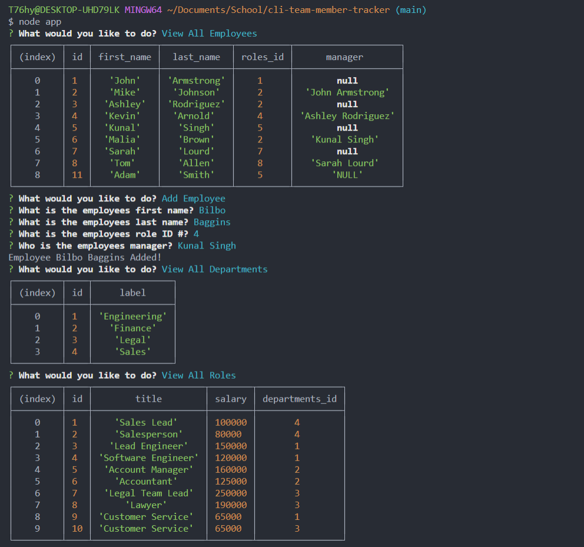

## Purpose
A command line interface to manage a company's employee database. This application uses Node.js, Inquirer, and MySQL. 

## ScreenShot

## Github URL Link: 
https://github.com/smith-utxo/cli-team-member-tracker

## Legal Notice
© Adam T. Smith, U of M Coding Boot Camp 

Licensed under the [MIT license](LICENSE)
## Contributors
- Adam T. Smith <smith.adam937@gmail.com> 